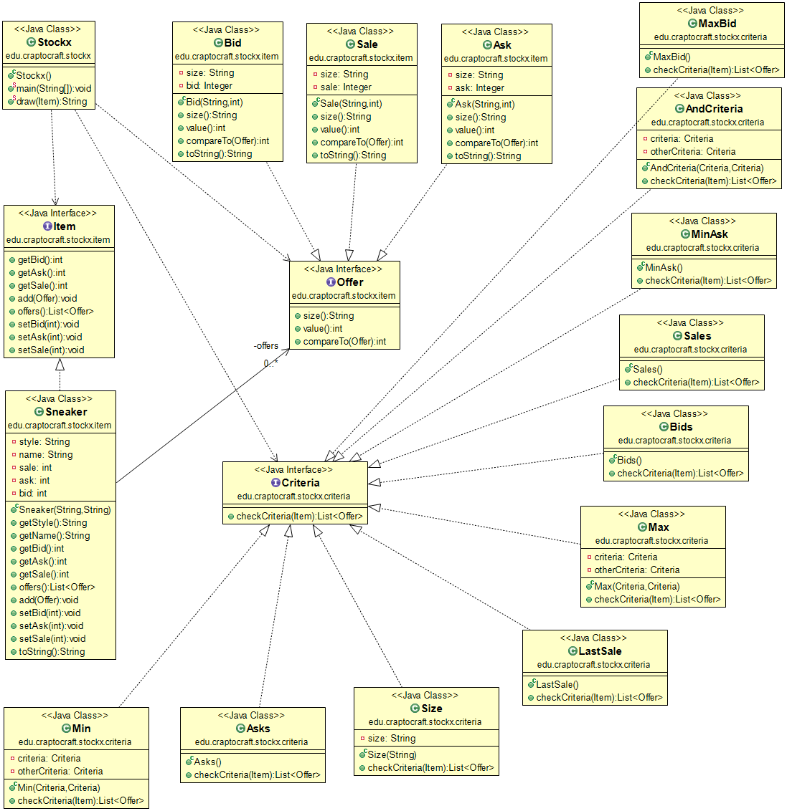
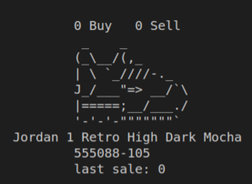
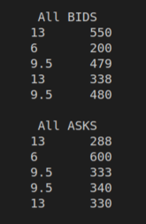
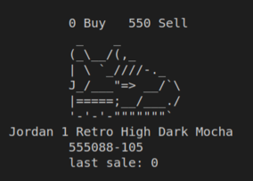
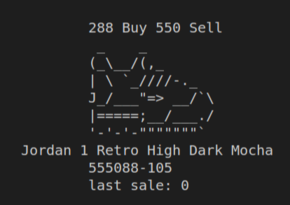
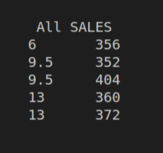
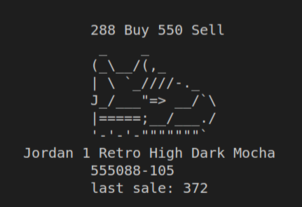
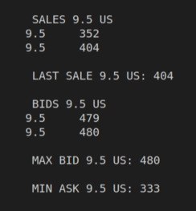
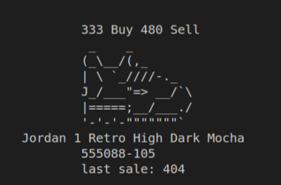

# StockX ASCII

**Table of contents**

-   [**Introduction**](#introduction)
-   [**About the exam**](#about-the-exam)
-   [**UML Diagram**](#uml-diagram)
-   [**Application output**](#application-output)

## Introduction

This is an exam in Java of previous years of Proggramation in CIFP Francesc de Borja Moll. The idea was to practice Java and gain a deeper understanding of Classes, ArrayLists, Lists, Conditional (Ternary) Operators, and Streams.   

**Link of the exam:** [StockX ASCII](https://github.com/dfleta/stockx-ascii).  

## About the exam

StockX was born in Detroit, and there they still do things the traditional way, robust and soulful, in ASCII on the CLI.

## UML Diagram

## Application output

   
   
   
   
   
   
   
   
